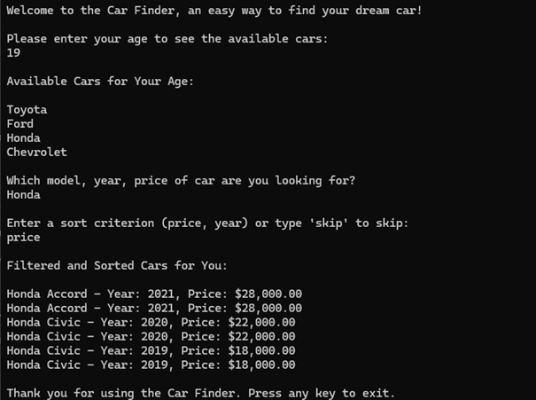
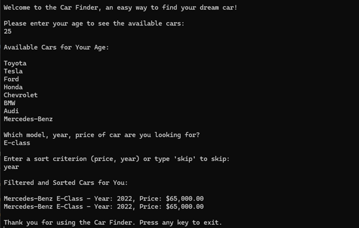
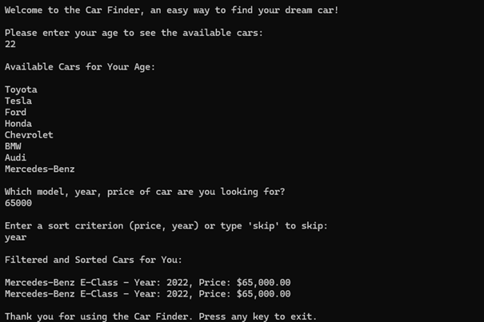
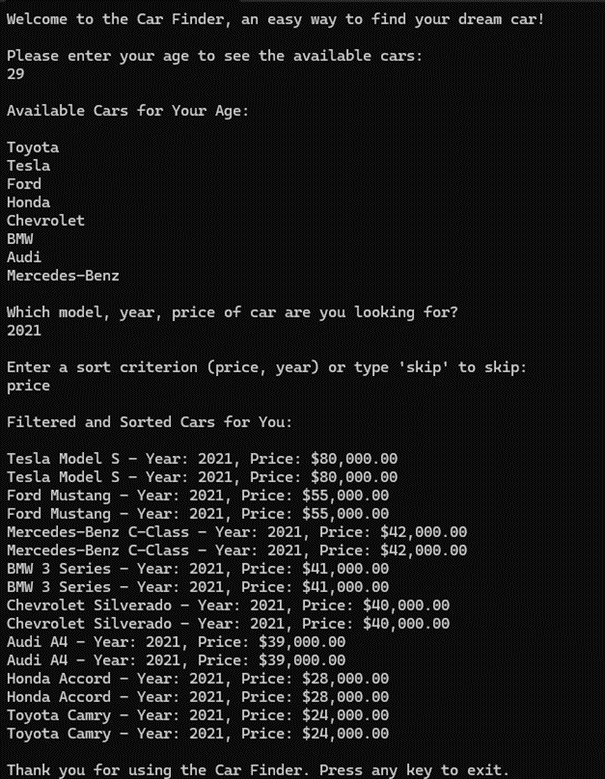

# Car Finder Application

Welcome to the Car Finder Application! This console-based application is designed to help users find their ideal car by filtering and sorting options based on criteria such as make, model, year, price, and age requirements. This project leverages the power of LINQ (Language Integrated Query) to efficiently query data from multiple sources.

## Table of Contents

- [Project Overview](#project-overview)
- [Features](#features)
- [Technologies Used](#technologies-used)
- [Setup and Installation](#setup-and-installation)
- [Usage](#usage)
- [How LINQ is Used](#how-linq-is-used)

## Project Overview

The Car Finder application allows users to search through a collection of car data stored in JSON and XML formats. By inputting their age and other search criteria, users can find cars that match their preferences and are eligible based on their age.

## Features

- **Age-based filtering**: Displays only cars that the user is eligible to purchase based on their age.
- **Search functionality**: Users can search for cars by make, model, year, or price range.
- **Sorting options**: Cars can be sorted by price, year, or make.
- **Multiple data sources**: The application loads data from both JSON and XML files.
- **Easy-to-use console interface**: Simple prompts guide the user through the process of finding a car.

## Technologies Used

- **.NET Core**: The application is built using .NET Core, a cross-platform framework for building modern applications.
- **C#**: The programming language used to develop the application.
- **LINQ**: Used for querying and manipulating the car data.
- **JSON and XML**: Data formats used for storing the car information.

## Setup and Installation

### Prerequisites

- .NET Core SDK installed on your machine.

### Steps

1. **Clone the repository**:
   ```bash
   git clone https://github.com/CodeSharon/LinqProject.git
   cd car-finder  
2. Open the solution: Open the LinqProject.sln file in Visual Studio.
3. Restore NuGet packages: Visual Studio should automatically restore any missing NuGet packages. If not, right-click on the solution and select "Restore NuGet Packages."
4. Run the application: Press F5 in Visual Studio to build and run the application.

## Usage
1. When the application starts, you will be prompted to enter your age.
2. Based on your age, the application will display available car makes.
3. You can then search for specific car models or filter by year or price range.
4. The results will be displayed, showing cars that match your search criteria, sorted as per your preference.

### How LINQ is Used

- **Filter data**: Cars are filtered by age requirements to ensure users only see cars they are eligible to purchase.
- **Search data**: LINQ is used to search across multiple fields, allowing users to find cars based on various criteria.
- **Sort data**: The application uses LINQ to sort cars by price, year, or make, depending on the user's input.

## Demo
### Search by car name


### Search by car model


### Search by car price


### Search by car year of manufacturing


